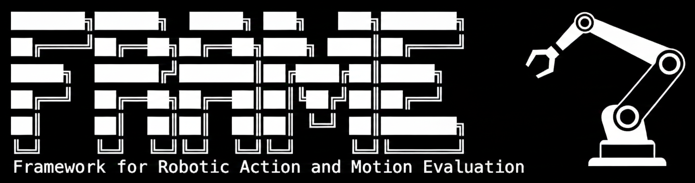

<p align="center">
  
</p>

<h1 align="center">FRAME: Framework for Robotic Action and Motion Evaluation</h1>

<p align="center">
  <a href="https://github.com/ameyawagh/robometric-frame/actions/workflows/ci.yml"></a>
  <a href="https://codecov.io/gh/ameyawagh/robometric-frame"></a>
  <a href="https://openreview.net/forum?id=LS7IoE1ro5"></a>
  <a href="https://www.python.org/downloads/"></a>
  <a href="https://opensource.org/licenses/MIT"></a>
</p>

<p align="center">
  <em>TorchMetrics-based evaluation metrics for robotics policies and robot learning models.</em>
</p>

## Overview

`robometric-frame` provides a comprehensive suite of evaluation metrics specifically designed for robotics policies, including learned controllers, imitation learning models, and reinforcement learning agents. Built on top of [TorchMetrics](https://torchmetrics.readthedocs.io/), it offers:

- **Easy Integration**: Drop-in compatibility with PyTorch, PyTorch Lightning, and Hugging Face
- **Distributed Training**: Native support for multi-GPU/multi-node training
- **Type Safety**: Full type annotations for better IDE support
- **Well Tested**: Comprehensive test coverage
- **Extensible**: Easy to extend with custom metrics

## Installation

```bash
# Install from source
git clone https://github.com/ameyawagh/robometric-frame.git
cd robometric-frame

# Using uv (recommended - faster)
uv venv
source .venv/bin/activate  # On macOS/Linux
# .venv\Scripts\activate   # On Windows
uv pip install -e .

# Or using pip
pip install -e .
```

## Quick Start

```python
import torch
from robometric_frame import SuccessRate, PathLength, ActionAccuracy

# Task Performance: Success Rate
metric = SuccessRate()
task_results = torch.tensor([1, 1, 0, 1, 0, 0, 1])
metric.update(task_results)
print(f"Success Rate: {metric.compute():.2%}")  # 57.14%

# Trajectory Quality: Path Length
metric = PathLength()
trajectory = torch.tensor([[0., 0.], [1., 0.], [1., 1.], [2., 1.]])
metric.update(trajectory)
print(f"Path Length: {metric.compute():.2f}")  # 3.00

# Task Performance: Action Accuracy
metric = ActionAccuracy()
predicted = torch.randn(10, 7)  # (timesteps, action_dim)
ground_truth = torch.randn(10, 7)
metric.update(predicted, ground_truth)
print(f"AMSE: {metric.compute():.4f}")
```

## Available Metrics

### Task Performance

- **SuccessRate** - Percentage of successfully completed tasks
- **TaskCompletionRate** - Multi-step task sequence completion
- **ActionAccuracy** - MSE, AMSE, NAMSE for action prediction accuracy

### Trajectory Quality

- **PathLength** - Total distance traveled in a trajectory
- **PathSmoothness** - Rate of change in trajectory direction
- **CurvatureChange** - Smoothness accounting for robot orientation
- **AbsoluteTrajectoryError (ATE)** - Global trajectory consistency
- **RelativeTrajectoryError (RTE)** - Local trajectory accuracy

See [docs/metrics.md](docs/metrics.md) for detailed formulas and references.

## Features

### Distributed Training Support

All metrics support distributed training out of the box:

```python
import torch.distributed as dist
from robometric_frame import SuccessRate

# Automatically syncs across all processes
metric = SuccessRate()

# Each process updates with its local data
local_results = torch.tensor([1, 0, 1])
metric.update(local_results)

# Compute aggregates results from all processes
global_success_rate = metric.compute()
```

### Multi-Batch Updates

Metrics can be updated incrementally:

```python
metric = SuccessRate()

# Update with multiple batches
for batch in dataloader:
    results = evaluate_batch(batch)
    metric.update(results)

# Compute overall success rate
overall_sr = metric.compute()

# Reset for next epoch
metric.reset()
```

### GPU Support

Metrics work seamlessly on GPU:

```python
metric = SuccessRate().to("cuda")
success = torch.tensor([1, 1, 0, 1], device="cuda")
metric.update(success)
result = metric.compute()  # Result is on GPU
```

## Integration Examples

### PyTorch Training Loop

```python
from robometric_frame import SuccessRate

success_metric = SuccessRate()

for epoch in range(num_epochs):
    for batch in dataloader:
        predictions = model(batch)
        success = evaluate_tasks(predictions, batch.targets)
        success_metric.update(success)

    epoch_sr = success_metric.compute()
    print(f"Epoch {epoch} SR: {epoch_sr:.2%}")
    success_metric.reset()
```

### PyTorch Lightning

```python
import pytorch_lightning as pl
from robometric_frame import SuccessRate

class RobotPolicyModel(pl.LightningModule):
    def __init__(self):
        super().__init__()
        self.val_success_rate = SuccessRate()

    def validation_step(self, batch, batch_idx):
        predictions = self(batch)
        success = self.evaluate(predictions, batch)
        self.val_success_rate.update(success)

    def on_validation_epoch_end(self):
        sr = self.val_success_rate.compute()
        self.log("val_sr", sr)
```

### Hugging Face Transformers

```python
from transformers import Trainer
from robometric_frame import SuccessRate

def compute_metrics(eval_pred):
    predictions, labels = eval_pred
    metric = SuccessRate()
    metric.update(torch.tensor(predictions))
    return {"success_rate": metric.compute().item()}

trainer = Trainer(
    model=model,
    compute_metrics=compute_metrics,
)
```

## Development

### Setup Development Environment

```bash
# Clone repository
git clone https://github.com/ameyawagh/robometric-frame.git
cd robometric-frame

# Using uv (recommended - faster)
uv venv
source .venv/bin/activate
uv pip install -e ".[dev]"
pre-commit install

# Or using pip
python -m venv .venv
source .venv/bin/activate
pip install -e ".[dev]"
pre-commit install
```

This installs all development dependencies (including documentation tools) and configures git hooks for automatic code quality checks on commit.

### Running Tests

```bash
# Run all tests
pytest

# Run with coverage
pytest --cov=robometric_frame --cov-report=html

# Run specific test file
pytest tests/test_success_rate.py -v
```

### Code Quality

Pre-commit hooks automatically run code quality checks before each commit:

```bash
# Run all pre-commit hooks manually
pre-commit run --all-files

# Run specific hooks
pre-commit run ruff --all-files         # Lint code
pre-commit run ruff-format --all-files  # Format code
pre-commit run mypy --all-files         # Type checking

# Or run individual tools directly
ruff check src/ tests/ examples/   # Lint
ruff format src/ tests/ examples/  # Format
mypy src/                          # Type check
```

**What runs on commit:**
- Code formatting (Ruff)
- Linting (Ruff)
- Type checking (Mypy)
- Import sorting (Ruff)
- YAML/TOML validation
- Trailing whitespace removal

### Building Documentation

The project uses [Sphinx](https://www.sphinx-doc.org/) to generate API documentation. Documentation dependencies are included in the `[dev]` extras, so no additional installation is needed.

```bash
# Navigate to docs directory
cd docs

# Build HTML documentation
make html

# The generated documentation will be in docs/build/html/
# Open it in your browser
open build/html/index.html  # macOS
# xdg-open build/html/index.html  # Linux
# start build/html/index.html  # Windows
```

#### Live Documentation Server

For development with auto-reload (rebuilds automatically when files change):

```bash
cd docs
make livehtml

# Server starts at http://127.0.0.1:8000
# Press Ctrl+C to stop
```

#### Other Documentation Formats

```bash
# Build PDF documentation (requires LaTeX)
make latexpdf

# Build EPUB documentation
make epub

# See all available formats
make help

# Clean previous builds
make clean
```

The documentation is automatically generated from:
- Docstrings in the source code
- RST files in `docs/source/`
- Type annotations and signatures

## Contributing

Contributions are welcome! Please see [CONTRIBUTING.md](CONTRIBUTING.md) for guidelines on:
- Setting up your development environment
- Branching strategy
- Testing requirements
- Submitting pull requests

## License

This project is licensed under the MIT License - see the [LICENSE](LICENSE) file for details.

## Citation

If you use this library in your research, please cite:

```bibtex
@inproceedings{wagh2026frame,
  title = {{FRAME}: Framework for Robotic Action and Motion Evaluation},
  author = {Ameya Wagh and Vishnu Rudrasamudram},
  booktitle = {ICML 2026 Workshop on Combining Theory and Benchmarks: Towards A Virtuous Cycle to Understand and Guarantee Foundation Model Performance},
  year = {2026},
  url = {https://openreview.net/forum?id=LS7IoE1ro5}
}
```

## References

See [docs/metrics.md](docs/metrics.md) for comprehensive references to research papers and methodologies.

## Acknowledgments

- Built on [TorchMetrics](https://torchmetrics.readthedocs.io/)
- Inspired by robotics research including RT-1, RT-2, and other robot learning methods
